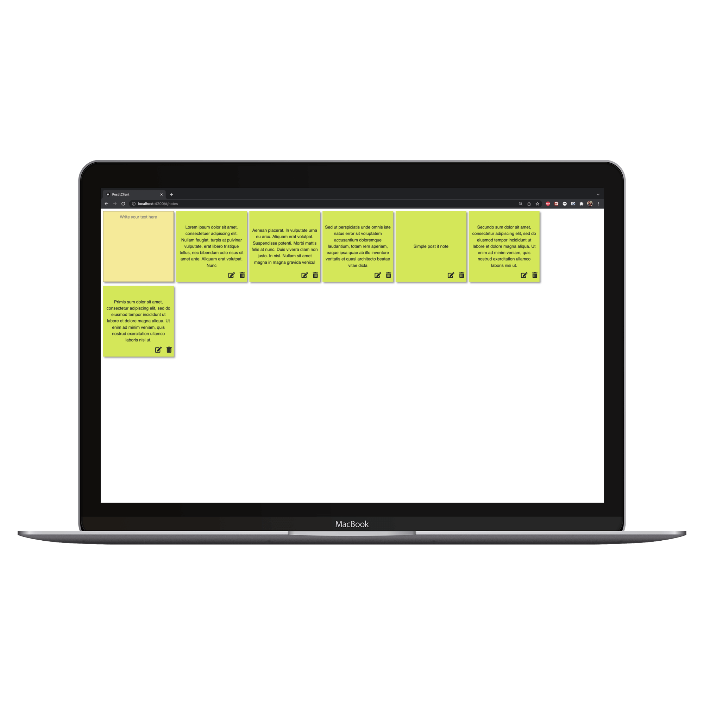
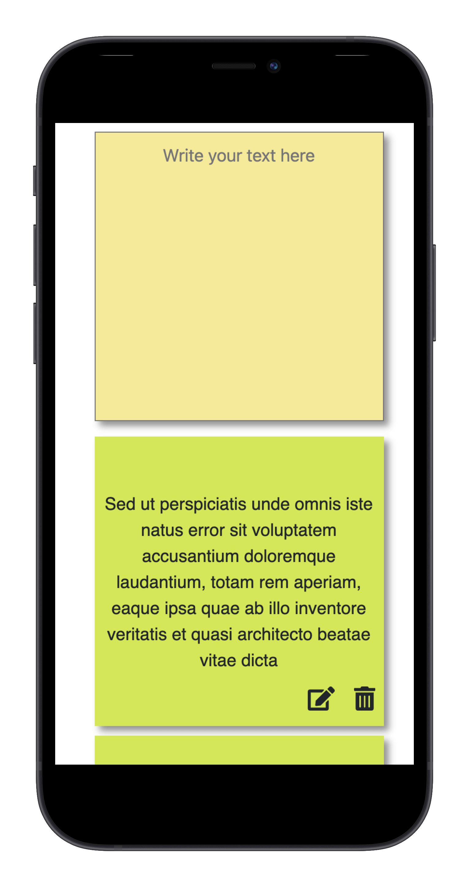

# PostIT notes web-app

###Prerequisites:

###Frontend:
[Angular CLI 12.05](https://angular.io/cli)

[Node: 12.16.1](https://nodejs.org/en/download/)

[Node Package Manager: npm 6.13.4](https://docs.npmjs.com/downloading-and-installing-node-js-and-npm)

###Backend:

[Java 11](https://www.oracle.com/java/technologies/downloads/)

[Maven](https://maven.apache.org/download.cgi)

[Docker](https://www.docker.com/products/personal)

[Docker Compose](https://docs.docker.com/compose/install/)

###Provide .env variables files to the root directory:
Example:

`POSTIT_DB_NAME=postit`

`POSTIT_DB_USER=post_it_user`

`POSTIT_DB_PASSWORD=post_it_user_password`

`POSTIT_DB_PORT=5432`

`POSTIT_BACKEND_PORT=8080`

`POSTIT_DB_HOST_NAME=postit_db`

###Run in Development mode:
###Frontend:
From `frontend` directory

`npm run start
`

###Backend:
From `project root` directory start docker compose with postgres instance:

`docker-compose up postit_db`

From `backend` directory run following command to start backend:

`./mvnw clean spring-boot:run
`

###Run in Production mode:

From `project root` directory package project jars:

`./mvnw -P prod -DskipTests clean package
`

Build docker image:

`docker build -t postit-app .
`

Start docker compose with database and app instances:
`docker-compose up`

#Preview:

